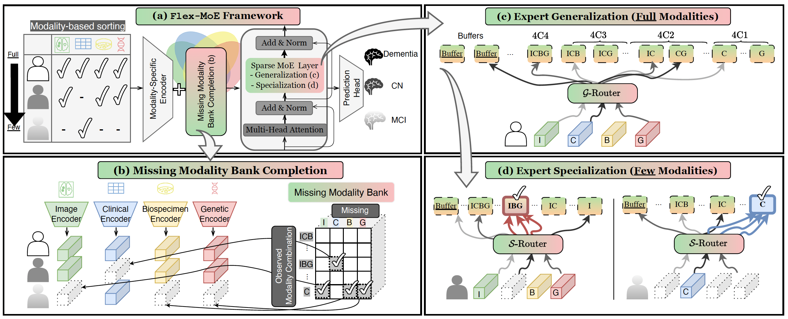

 # Flex-MoE: Modeling Arbitrary Modality Combination via the Flexible Mixture-of-Experts

[](https://opensource.org/licenses/MIT) [](https://neurips.cc/)

Official implementation for "Flex-MoE: Modeling Arbitrary Modality Combination via the Flexible Mixture-of-Experts" accepted by NeurIPS 2024 (Spotlight).  

- Authors: [Sukwon Yun](https://sukwonyun.github.io/), [Inyoung Choi](https://www.linkedin.com/in/inyoung-choi-77105221b/), [Jie Peng](https://openreview.net/profile?id=~Jie_Peng4), Yangfan Wu, [Jingxuan Bao](https://jingxuanbao.github.io/), [Qiyiwen Zhang](https://www.linkedin.com/in/qiyiwen-zhang-438354133), [Jiayi Xin](https://www.linkedin.com/in/jiayi-xin/), [Qi Long](https://www.med.upenn.edu/long-lab/currentgroupmembers.html) and [Tianlong Chen](https://tianlong-chen.github.io/)

## Overview

Multimodal learning has gained increasing importance across various fields, offering the ability to integrate data from diverse sources such as images, text, and personalized records, which are frequently observed in medical domains. However, in scenarios where some modalities are missing, many existing frameworks struggle to accommodate arbitrary modality combinations, often relying heavily on a single modality or complete data. This oversight of potential modality combinations limits their applicability in real-world situations. To address this challenge, we propose Flex-MoE (Flexible Mixture-of-Experts), a new framework designed to flexibly incorporate arbitrary modality combinations while maintaining robustness to missing data. The core idea of Flex-MoE is to first address missing modalities using a new missing modality bank that integrates observed modality combinations with the corresponding missing ones. This is followed by a uniquely designed Sparse MoE framework. Specifically, Flex-MoE first trains experts using samples with all modalities to inject generalized knowledge through the generalized router ($\mathcal{G}$-Router). The $\mathcal{S}$-Router then specializes in handling fewer modality combinations by assigning the top-1 gate to the expert corresponding to the observed modality combination. We evaluate Flex-MoE on the ADNI dataset, which encompasses four modalities in the Alzheimer's Disease domain, as well as on the MIMIC-IV dataset. The results demonstrate the effectiveness of Flex-MoE highlighting its ability to model arbitrary modality combinations in diverse missing modality scenarios.



## **Environmental Setup (Step-by-step guide to install FastMoE library)**

```
conda create -n flex-moe python=3.10 -y
conda activate flex-moe
conda install pytorch==2.0.1 torchvision==0.15.2 torchaudio==2.0.2 pytorch-cuda=11.7 -c pytorch -c nvidia -y
conda install nvidia::cudatoolkit conda-forge::cudatoolkit-dev -y
conda install -c conda-forge gxx=10.4 -y
export LD_LIBRARY_PATH=/path_to_anaconda3/flex-moe/lib:$LD_LIBRARY_PATH
export CUDA_HOME=/path_to_anaconda3/envs/flex-moe
git clone https://github.com/laekov/fastmoe.git 
cd fastmoe 
USE_NCCL=0 python setup.py install
cd ..
conda install dm-tree scikit-learn tqdm pandas -y
conda install -c conda-forge scanpy nibabel -y
```

## **Dataset (ADNI)***
***For the details, please refer to [data/adni/README.md](data/adni/README.md)**

1. To access ADNI dataset, please first visit ADNI website: https://adni.loni.usc.edu/ and apply for the data access here: https://ida.loni.usc.edu/collaboration/access/appApply.jsp?project=ADNI.
2. Once you get an access, login to IDA and dowlonad necessary files for each modality.
    - Image:
        - {Subject ID}_{Scan date}
    - Genomic:
        - ADNI 1 SNP genotype data - PLINK
        - ADNI GO/2 SNP genotype data - Complete PLINK for sets 1 - 9
        - ADNI GO/2 SNP genotype data - Complete PLINK for sets 10 - 15
        - ADNI3 SNP genotype data Set 1 - PLINK
        - ADNI3 SNP genotype data Set 2 - PLINK
    - Clinical:
        - MEDHIST
        - NEUROEXM
        - PTDEMOG
        - RECCMEDS
        - VITALS
    - Biospecimen:
        - APOERES
        - UPENNBIOMK_ROCHE_ELECSYS

3. Once the files are ready, please run preprocessing codes in each modality.

## **Dataset (Others)**
**To run Flex-MoE in other datasets based on existing dataloader format, please customize below two parts.**

1. `main.py`
    - As in [line 114](https://github.com/UNITES-Lab/flex-moe/blob/main/main.py#L114) in `main.py`, please define dataset specific `modality_dict`.
    - While setting the modality name, please (1) use small letter while (2) enusring each modality's first letter is unique.
    - Example:
        ```
        if args.data == 'your_new':
            modality_dict = {'a_modality':0, 'b_modality': 1, 'c_modality': 2}
        ```

2. `data.py`
    - Please (1) set an appropriate path to the dataset and (2) cutomize each modality with its own speicifc preprocessing (e.g., initial fillling, MinMaxScaler).  
    - Example:
        ```
        def load_and_preprocess_new_data(args, modality_dict):
            # Paths
            a_modality_path = './data/your_dataset/a_modality'
            b_modality_path = './data/your_dataset/b_modality'
            c_modality_path = './data/your_dataset/c_modality'
            label_df = pd.read_csv('./data/your_dataset/your_label_csv_file', index_col='your_index')
            labels = label_df['your_label'].values.astype(np.int64)
            
            with open('./data/your_dataset/your_index_train_valid_test_split.json') as json_file:
                data_split = json.load(json_file)

            id_to_idx = {id: idx for idx, id in enumerate(label_df.index)}
            common_idx_list = []
            observed_idx_arr = np.zeros((labels.shape[0], args.n_full_modalities), dtype=bool)

            # Load modalities (a_modality as an example)
            if 'A' in args.modality or 'a' in args.modality:
                if args.initial_filling == 'mean':
                    path = a_modality_path + '_mean.csv'
                else:
                    path = a_modality_path + '.csv'

                ...
        ```


## **Usage and Examples**
**Run Example**
```
python main.py \
    --data adni \
    --modality IG \
    --lr 1e-3 \
    --num_experts 16 \
    --num_layers_fus 1 \
    --top_k 4 \
    --train_epochs 50 \
    --warm_up_epochs 5 \
    --hidden_dim 128 \
    --batch_size 16 \
    --n_runs 3 \
    --device 0
```

**IGCB Result**
```
sh run_adni_igcb.sh
```

## **Citation**

```bibtex
@misc{yun2024flexmoemodelingarbitrarymodality,
      title={Flex-MoE: Modeling Arbitrary Modality Combination via the Flexible Mixture-of-Experts}, 
      author={Sukwon Yun and Inyoung Choi and Jie Peng and Yangfan Wu and Jingxuan Bao and Qiyiwen Zhang and Jiayi Xin and Qi Long and Tianlong Chen},
      year={2024},
      eprint={2410.08245},
      archivePrefix={arXiv},
      primaryClass={cs.LG},
      url={https://arxiv.org/abs/2410.08245}, 
}
```

